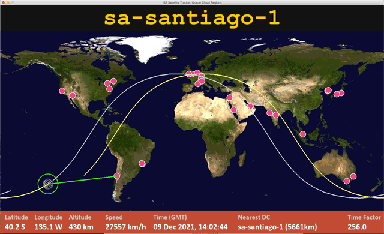

## ISS Tracker

*<p align="right">Inspired by the NASA ISS Tracker: https://spotthestation.nasa.gov/tracking_map.cfm</p>*

Python programs showing position and other data of the ISS. There are two programs:

Two main scripts:
* iss_tracker.py - a simple text or python rich terminal version showing ISS data and closest place
* iss_tracker_map - a graphical version showing all the locations from a supplied list and the orbit of the ISS

<p align="center"></p>

The animated map based version of the ISS tracker  shows a list of given places and shows which one is currently the closest to the ISS.
Originally built in my time at Oracle as a novel way to highlight Oracle OCI cloud data centres around the world, but now displays the world's capital cities, but you can easily add any list you like to places.py.

Each ISS orbit is roughly 90 minutes, but the map version allows you to control the speed to go into the future or the past.

It uses satellite data from NORAD and the skyfield python library to compute the satellite's position and launches a separate window using pygame.

iss_tracker_map.py responds to the following keys while running:
```
    +/-      Speed up/slow down the ISS, dropping below 1x speed reverses the ISS!
    1        Reset ISS speed to real time
    P        Pause (freeze movement)
    R        Reset to current (actual) ISS position
    N        Display Night/Day terminator
    Esc/Q    Quit
```

Uses fonts Courier New & Calibri. You may need to install them on your system
